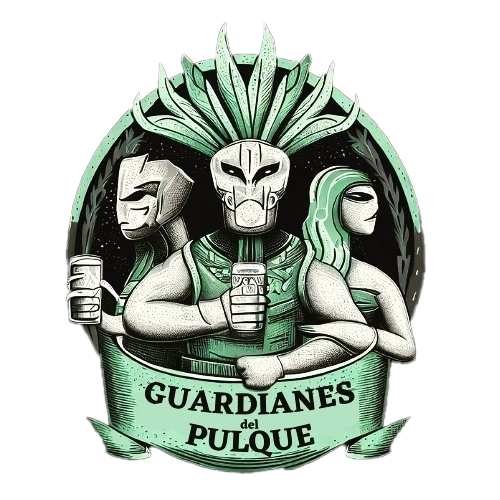

<p align="center">
  
</p>

<h1 align="center">Guardianes del Pulque</h1>

<p align="center">
  <strong>Maguey · Tierra · Pulque</strong><br>
  Historias, guías y proyectos para cultivar, construir y cuidar el territorio.
</p>

<p align="center">
  <a href="https://guardianesdelpulque.org">guardianesdelpulque.org</a>
</p>

---

## Qué es

Un sitio comunitario de conocimiento abierto sobre **pulque**, **bioconstrucción** y **naturaleza** en México. Artículos, ensayos y guías prácticas publicados automáticamente cada semana.

## Cómo funciona

```
HTML estático + GitHub Pages — sin frameworks, sin build
```

| Archivo | Función |
|---------|---------|
| `index.html` | Homepage con hero, artículos recientes y donaciones |
| `posts.html` | Listado completo paginado |
| `posts.json` | Registro central de artículos |
| `articulos/{slug}/` | Cada artículo con su HTML y portada |

## Publicación automática

Cada **viernes a las 7:00 AM (México)** un GitHub Action genera un artículo nuevo:

1. **GPT-4o-mini** escribe el texto con tonos variados (práctico, poético, narrativo, conciso)
2. **DALL-E 3** genera la portada (estilos: mural mexicano, impresionista, acuarela)
3. Se crea `articulos/{slug}/{slug}.html` + `{slug}.png`
4. Se actualiza `posts.json`
5. Commit y push automático — GitHub Pages lo publica al instante

```
Viernes 7am  →  generate-post.js  →  GPT + DALL-E  →  git push  →  Live
```

## Artículos publicados

| | Título | Tema |
|-|--------|------|
| 1 | De la penca al jarro: el proceso vivo | Pulque |
| 2 | Guía práctica de adobe | Bioconstrucción |
| 3 | Microbiota del pulque: quién es quién | Pulque |
| 4 | Noticias verdes: restauración y polinizadores | Naturaleza |
| 5 | Humedales urbanos: manual de bolsillo | Naturaleza |
| 6 | Bambú estructural | Bioconstrucción |
| 7 | Utensilios tradicionales del tinacal | Pulque |
| 8 | Suelos vivos | Naturaleza |
| 9 | Tierra compactada (BTC / Rammed Earth) | Bioconstrucción |
| 10 | Cadena de valor del maguey | Pulque |

*La lista crece cada viernes.*

## Ejecución local

```bash
# Instalar dependencias
npm install

# Levantar servidor local
npx http-server . -p 8080

# Generar un artículo manualmente
node scripts/generate-post.js
```

Requiere `OPENAI_API_KEY` en `.env`.

## Apoyar el proyecto

El sitio incluye una sección de donaciones. Tu apoyo impulsa talleres, regeneración de suelos, y mantiene esta biblioteca abierta.

**CLABE (BBVA):** `012 180 01568369912 6`

---

<p align="center">
  <sub>Hecho con tierra, pulque y código abierto.</sub>
</p>
